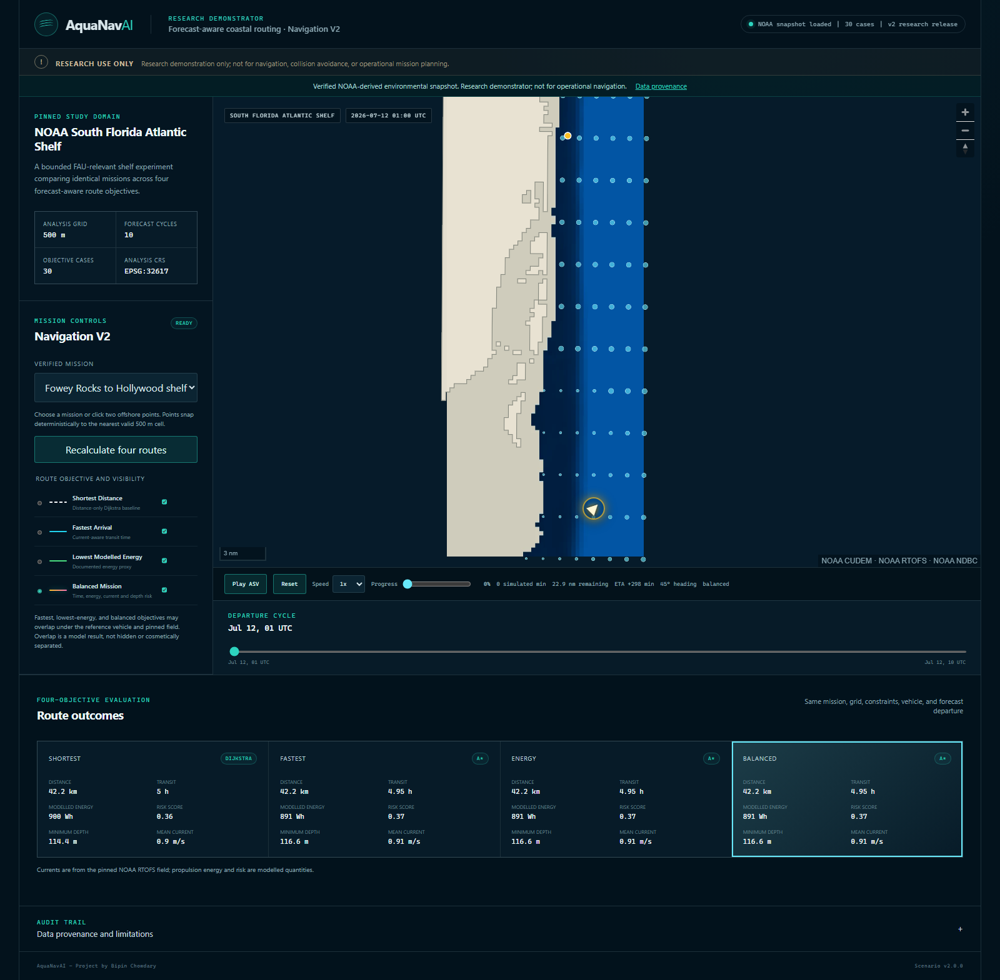
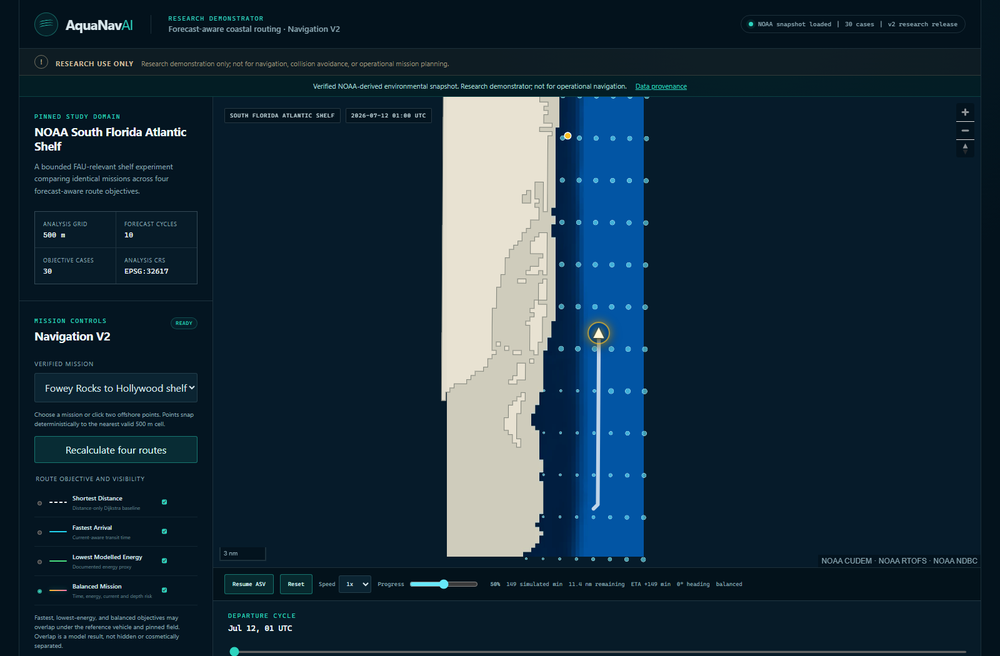
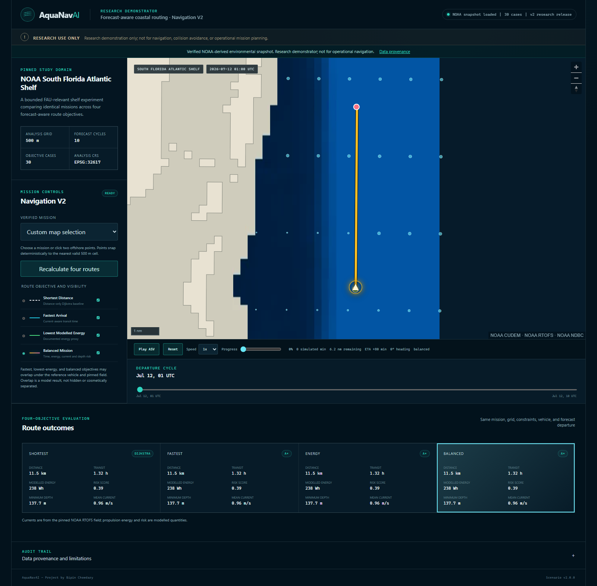
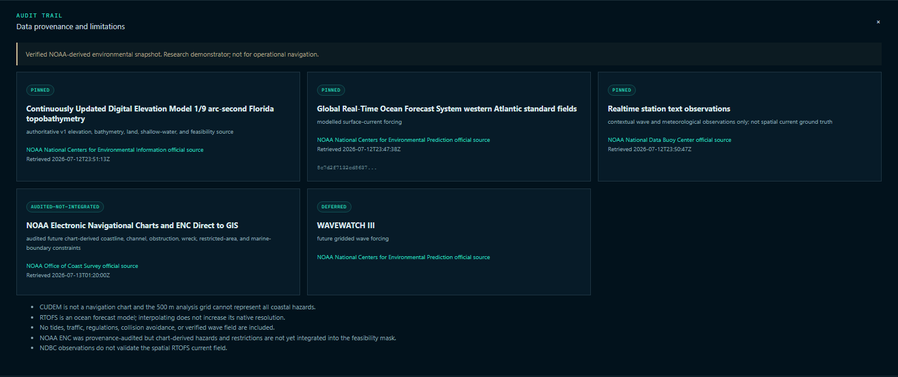
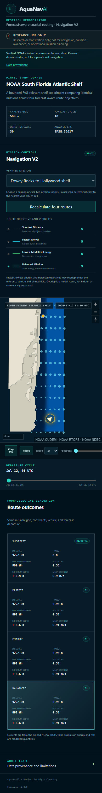
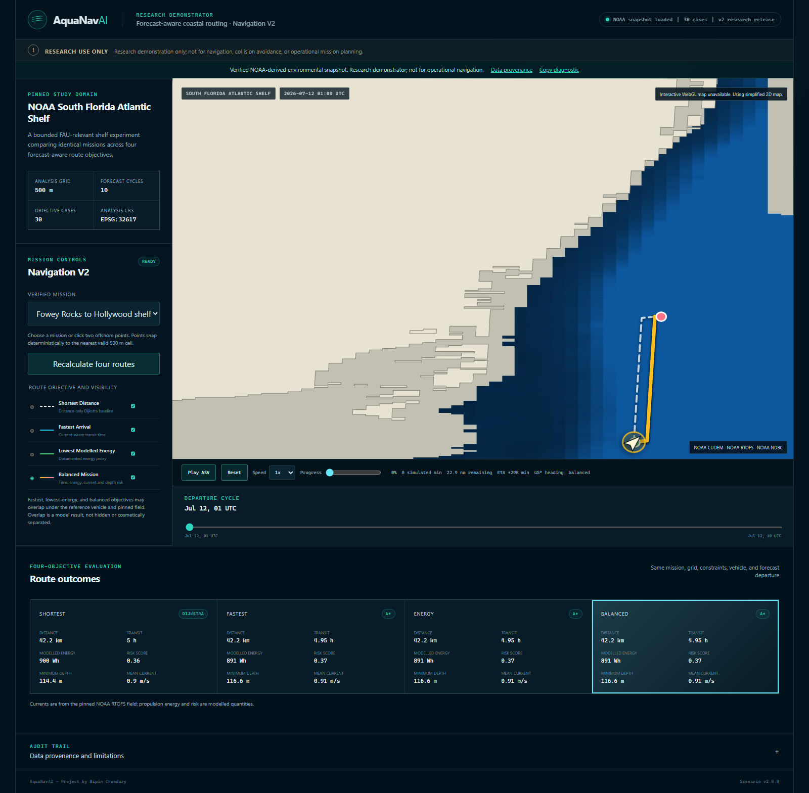
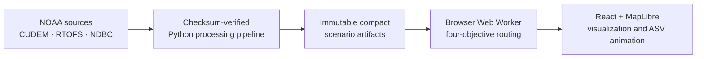

# AquaNavAI

Forecast-aware coastal mission planning for autonomous surface vehicles.

[](https://github.com/BipinChowdary/AquaNavAI/actions/workflows/ci.yml)

AquaNavAI is an interactive research demonstrator that compares four coastal route-planning objectives using a common navigability grid, NOAA-derived bathymetry, modelled ocean-current fields, and a reproducible browser-based workflow.

**[Live demonstration](https://aquanavai.pages.dev/)** · **[Source repository](https://github.com/BipinChowdary/AquaNavAI)** · **[Research documentation](docs/research-design.md)**

> **Research demonstration only. AquaNavAI is not intended for operational navigation, collision avoidance, vessel control, or safety-critical mission planning.**

## Project overview

AquaNavAI examines a practical research question: how can the same coastal mission change when a planner minimizes distance, transit time, or a modelled electrical-energy proxy while accounting for a pinned forecast-current field? The production application runs entirely in the browser, recomputes all four objectives in a Web Worker, and displays the exact planner-node geometry without decorative smoothing.

The released South Florida scenario is deterministic and same-origin. Its compact map layers, routing grid, metrics, and provenance are bundled with the static application, so a demonstration does not depend on a live NOAA API, remote map tiles, or a Python server.

## Why I started AquaNavAI

I started AquaNavAI in 2026 to connect my background in Electrical and Electronics Engineering, artificial intelligence, machine learning, and robotics with my growing interest in marine autonomy and ocean engineering. I wanted to move beyond a simple shortest-path demonstration and build a reproducible platform that shows how coastal bathymetry and forecast ocean currents can affect autonomous surface vehicle route planning.

## What the project demonstrates

- Creates a navigability representation from pinned coastal data.
- Compares four route objectives under the same mission, grid, constraints, reference vehicle, and environmental conditions.
- Visualizes route geometry, environmental context, route metrics, and ASV mission progress.
- Supports deterministic, offline-capable professor and research demonstrations.
- Preserves source URLs, versions, transformations, checksums, and scenario provenance.
- Provides a basis for prospective multi-cycle Experiment V2 research.

## Screenshot gallery



<sub><strong>Production overview.</strong> The pinned NOAA-derived scenario, four objective controls, map, forecast-valid departure selector, route metrics, attribution, and research warning in one production-build capture.</sub>

<table>
  <tr>
    <td width="50%">
      
      <br><sub><strong>Exact-route animation.</strong> The ASV is paused at 50% of the selected route; the capture check independently matched its coordinate to cumulative-distance interpolation on the released planner geometry.</sub>
    </td>
    <td width="50%">
      
      <br><sub><strong>Custom mission.</strong> Two valid offshore points are snapped to the grid and all four planners return route metrics. Legitimate route overlap is retained rather than cosmetically separated.</sub>
    </td>
  </tr>
  <tr>
    <td width="50%">
      
      <br><sub><strong>Provenance and limits.</strong> Pinned model inputs, contextual observations, audited-but-not-integrated ENC data, and deferred wave forcing are distinguished explicitly.</sub>
    </td>
    <td width="50%">
      
      <br><sub><strong>Responsive view.</strong> The warning, planner controls, map, animation controls, and four metric cards remain available on a 390-pixel viewport.</sub>
    </td>
  </tr>
  <tr>
    <td colspan="2">
      
      <br><sub><strong>No-WebGL fallback.</strong> A verified simplified 2D renderer preserves route inspection, controls, attribution, metrics, and ASV movement when WebGL is unavailable.</sub>
    </td>
  </tr>
</table>

These images are Playwright captures from the production build and the pinned same-origin scenario. They are not mockups or reconstructed route drawings.

## Four route-planning objectives

All objectives use the same 500 m eight-neighbour grid, endpoints, feasibility mask, reference vehicle, departure, current field, and forecast horizon. Waiting and forecast extrapolation are disabled; infeasibility is reported rather than bypassed.

| Objective                  | Implemented definition                                                                                                                                                                                    |
| -------------------------- | --------------------------------------------------------------------------------------------------------------------------------------------------------------------------------------------------------- |
| **Shortest Distance**      | Distance-only Dijkstra baseline over feasible graph edges.                                                                                                                                                |
| **Fastest Arrival**        | Deterministic time-expanded search minimizing current-aware transit time.                                                                                                                                 |
| **Lowest Modelled Energy** | Deterministic time-expanded search minimizing the documented reference-vessel electrical-energy proxy.                                                                                                    |
| **Balanced Mission**       | A normalized combination of transit time (0.35), modelled energy (0.35), current exposure (0.15), and shallow-water context (0.15), evaluated per fixed 500 m reference step. This is not a safety score. |

Different objectives can legitimately return identical geometry under the pinned field and reference vehicle. AquaNavAI does not manufacture visual differences between overlapping solutions.

## Data sources and scientific boundaries

| Source                                                                                                               | Released role                                                                                   | Scientific boundary                                                                                                              |
| -------------------------------------------------------------------------------------------------------------------- | ----------------------------------------------------------------------------------------------- | -------------------------------------------------------------------------------------------------------------------------------- |
| [NOAA NCEI CUDEM](https://www.ncei.noaa.gov/products/coastal-elevation-models) Florida 1/9-arc-second topobathymetry | Five pinned tiles provide V1 elevation, bathymetry, land, shallow-water, and feasibility input. | Reprojected to a 500 m analysis grid; not a nautical chart or chart-datum safety surface.                                        |
| [NOAA Global RTOFS](https://www.nco.ncep.noaa.gov/pmb/products/rtofs/), 2026-07-12 00Z                               | One initialization supplies released modelled surface-current fields.                           | The ten released departure/forecast-valid times are not ten independent forecast cycles. RTOFS is model output, not observation. |
| [NOAA NDBC](https://www.ndbc.noaa.gov/) stations 41122 and LKWF1                                                     | Contextual wave and meteorological observations.                                                | Point observations are not spatial current ground truth and do not replace or validate the full RTOFS field.                     |
| [NOAA ENC](https://nauticalcharts.noaa.gov/charts/noaa-enc.html)                                                     | Provenance-audited future chart context.                                                        | No ENC feature currently changes the released feasibility mask.                                                                  |
| [NOAA WAVEWATCH III](https://polar.ncep.noaa.gov/waves/download.shtml)                                               | Deferred future wave forcing.                                                                   | No wave value enters the released routing costs.                                                                                 |

Exact product identifiers, URLs, retrieval timestamps, variables, units, transformations, and SHA-256 checksums are recorded in [`data/catalog.yaml`](data/catalog.yaml) and the released [`PROVENANCE.md`](public/scenarios/south-florida-noaa-v1/PROVENANCE.md). The deterministic [`south-florida-v1`](public/scenarios/south-florida-v1/) scenario is a software proxy fixture and is never represented as NOAA-derived.

## System workflow and architecture



The Python engine is the processing and release system of record. Cloudflare Pages serves only the static React application and bounded processed artifacts; there is no production Python backend. The browser validates the artifact contract, loads same-origin files, initializes one persistent routing worker, and renders the resulting routes and animation.

See [`docs/architecture.md`](docs/architecture.md) for the trust boundary and [`docs/navigation-v2-verification.md`](docs/navigation-v2-verification.md) for the production behavior record.

## Current research status

| Workstream             | Status                                                                                                                                                                                                             |
| ---------------------- | ------------------------------------------------------------------------------------------------------------------------------------------------------------------------------------------------------------------ |
| Production application | **AquaNavAI 0.2.0** is publicly deployed at the canonical Cloudflare Pages URL.                                                                                                                                    |
| Experiment V1          | Reproducible exploratory fixed-case package prepared on the unmerged research branch; useful for method checking, not confirmatory inference.                                                                      |
| Experiment V2          | Preregistered prospective infrastructure is frozen locally and remains unmerged/unpublished pending disclosure review. It contains zero confirmatory outcomes until real eligible independent cycles are acquired. |
| IEEE manuscript        | Not ready for final results or conclusions. No publication, acceptance, or venue claim is made.                                                                                                                    |
| Operational readiness  | Research demonstration only; not for navigation.                                                                                                                                                                   |

Exploratory V1 values are intentionally not presented here as conclusive findings. Experiment V2 is designed to separate independent initialization cycles from forecast-valid times within one initialization.

## Quick start

Prerequisites are Node.js 24, npm 11, uv 0.11, and Python 3.12. The pinned versions are recorded in repository configuration and lockfiles.

```powershell
npm ci
uv sync --frozen --project engine --python 3.12.13
uv run --project engine aquanav data validate --scenario south-florida-noaa-v1
npm run dev
```

Open `http://localhost:5173` while the development server is running. Normal browser operation uses only same-origin scenario files.

## Full verification commands

```powershell
# Frontend type checking, ESLint, Vitest, production build, and asset limits
npm run check

# Pinned scenario contract and checksums
uv run --project engine aquanav data validate --scenario south-florida-noaa-v1

# Python quality, typing, tests, and dependency audit
uv run --project engine ruff check engine/src engine/tests
uv run --project engine mypy --config-file engine/pyproject.toml engine/src
uv run --project engine pytest
uv run --project engine pip-audit

# Production-equivalent Chromium behavior suite
npx playwright install chromium
npm run test:e2e

# Explicit production bundle
npm run build
```

The GitHub Actions workflow runs the equivalent checks on pull requests and `main`.

## Reproducibility and provenance

- Raw NOAA downloads remain under ignored `data/raw/`; only bounded processed artifacts are committed.
- [`data/catalog.yaml`](data/catalog.yaml) records source and processed checksums, source metadata, units, CRS, missing-value rules, and transformations.
- [`public/scenarios/south-florida-noaa-v1/manifest.json`](public/scenarios/south-florida-noaa-v1/manifest.json) checksums every released scenario artifact.
- JSON Schema, Python, TypeScript, and browser tests validate the release contract.
- The static demo makes no runtime NOAA or third-party tile request and can be exercised with external network traffic blocked.
- Interpolation onto the analysis grid is not described as increasing native environmental resolution.

To rebuild the pinned NOAA scenario from the checksum-verified cache—or explicitly acquire a missing catalogued file during this build command—run:

```powershell
uv run --project engine python -m aquanavai.pipeline.build_noaa_scenario --config data/catalog.yaml
```

## Repository structure

```text
engine/                 Python 3.12 data, routing, evaluation, and export engine
src/                    React, TypeScript, MapLibre, Web Worker, and animation code
public/scenarios/       Immutable compact release artifacts and proxy fixture
data/catalog.yaml       NOAA source catalog, transformations, and checksums
docs/                   Architecture, provenance, research, demo, and release records
tests/e2e/              Production-build Playwright behavior and fallback checks
.github/workflows/      Continuous verification
```

## Practical uses

AquaNavAI can be used to:

- Demonstrate environmental route planning to professors and researchers.
- Compare planner behavior under controlled, matched conditions.
- Teach the difference between distance, time, energy-proxy, and balanced objectives.
- Explore how bathymetry and forecast currents influence feasible coastal missions.
- Test reproducible geospatial and scientific-software workflows.
- Provide a foundation for broader experiments across cycles, regions, missions, vehicle settings, and grid resolutions.

It does not find a certified “safest” route and does not replace nautical charts, vessel operators, collision-avoidance systems, or approved navigation equipment.

## Limitations

- The released study uses one pinned RTOFS 2026-07-12 00Z initialization and ten forecast-valid/departure times; those times are correlated members of one forecast product, not independent cycles.
- CUDEM and RTOFS are regridded to a 500 m analysis grid. This cannot resolve every coastal structure, channel, hazard, or nearshore process.
- RTOFS currents are modelled; NDBC context does not provide spatial current validation.
- Modelled energy values are reference proxies, not measured vessel-energy observations or calibrated platform performance.
- ENC hazards and restrictions, WAVEWATCH III forcing, tides, traffic, collision avoidance, uncertainty propagation, and calibrated vessel dynamics are not integrated.
- The balanced objective provides contextual trade-off scoring, not operational risk or safety certification.
- No learned cost model or global-optimality claim is made for the current release.

## Roadmap

- Acquire eligible independent RTOFS initialization cycles and execute the preregistered Experiment V2 protocol after disclosure review.
- Evaluate mission, vehicle, departure, grid-resolution, and uncertainty sensitivity without suppressing null or adverse findings.
- Add cycle-aligned wave forcing only after a bounded authoritative product and validation method are pinned.
- Calibrate energy modelling against defensible simulator or platform labels before making measured-performance claims.
- Prepare an IEEE-style manuscript only after confirmatory evidence, claim review, and complete provenance are available.

## About the developer

AquaNavAI is developed by Bipin Chowdary, an M.S. Artificial Intelligence student at Florida Atlantic University. His background includes a Diploma in Electrical and Electronics Engineering and a B.Tech (Hons) focused on Artificial Intelligence and Machine Learning, with experience and interests spanning Robotics and Automation. His research direction includes marine AI, autonomous systems, ocean engineering, robotics, and reproducible applied research.

- [Portfolio](https://bipinchowdary.github.io/)
- [GitHub](https://github.com/BipinChowdary)

Created and maintained by Bipin Chowdary. AquaNavAI is an independent project; no university sponsorship, approval, validation, or endorsement is claimed.

## Citation and reuse status

Citation metadata are provided in [`CITATION.cff`](CITATION.cff). No DOI, paper publication, institutional ownership, or open-source license is claimed.

This repository is publicly viewable for research review and reproducibility. No open-source license is currently granted. Contact the author before reuse or redistribution. NOAA source products remain subject to their applicable source terms.

## Safety disclaimer

**Research demonstration only; not for navigation.** Do not use AquaNavAI for operational navigation, collision avoidance, vessel control, voyage planning, emergency response, or any safety-critical decision. Route outputs are based on incomplete environmental and constraint models and require independent professional validation before any real-world use.
